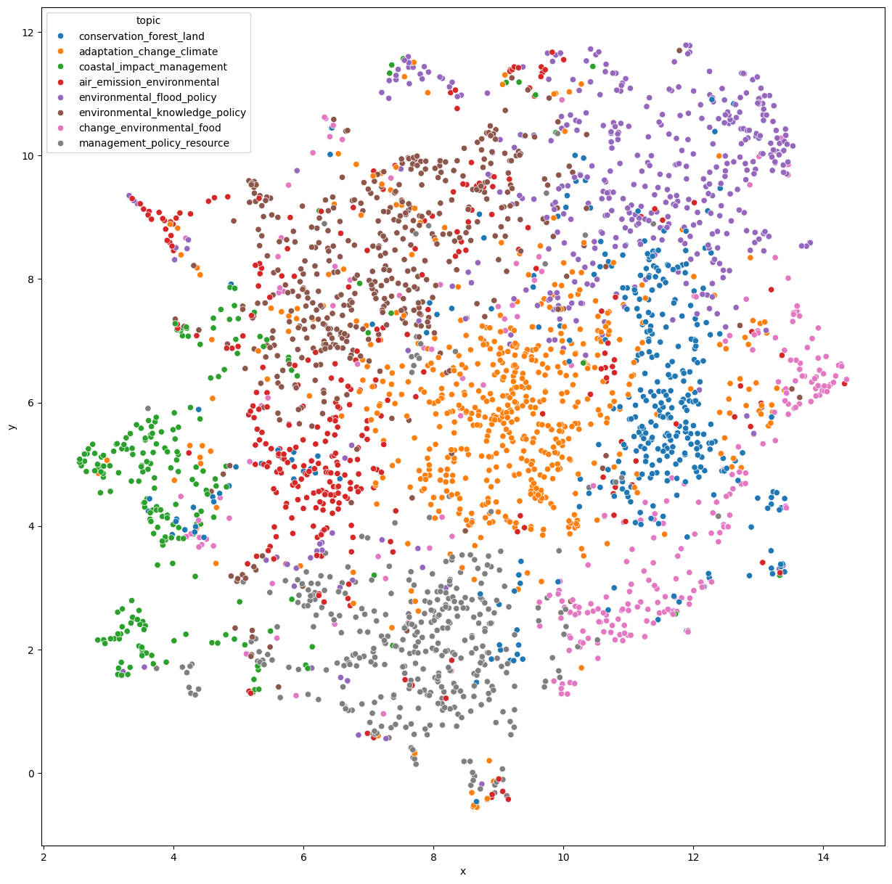

# NLP-Workshop-2024
Check [here](workshop.ipynb) for our process of extracting semantic topics via embedding and clustering.

Common topics observed in abstract that are crawled from Environmental Science and Policy Research Journal
